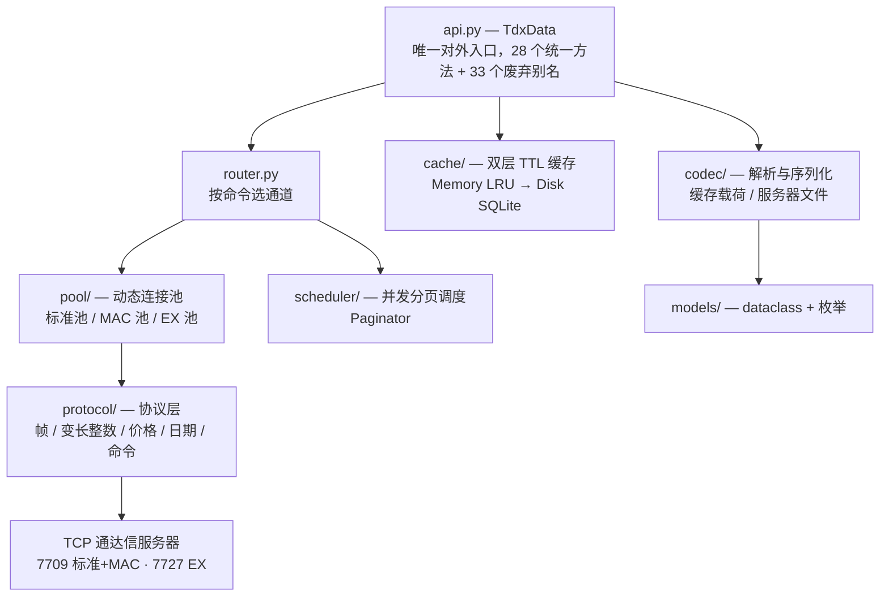
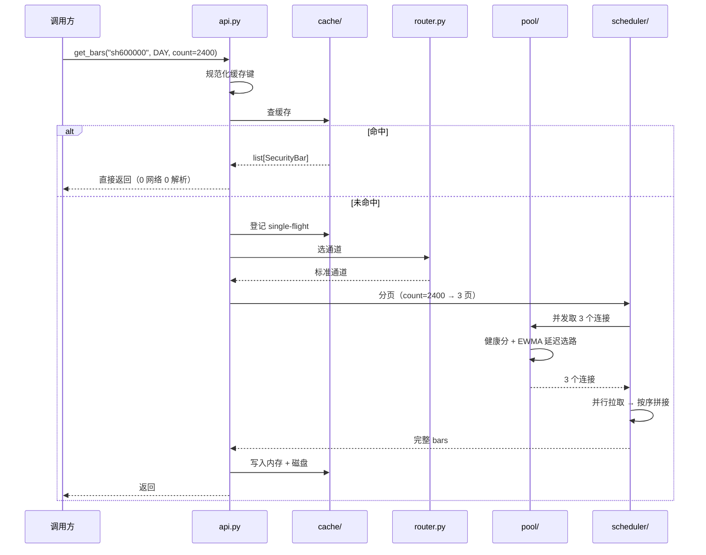

# 架构总览

## 分层

调用链是单向的，每一层只依赖它下面的一层——想加新接口时先想清楚「这属于哪一层」。



## 目录

```
src/pytdxdata/
├── api.py              # 统一接口 TdxData（对外唯一入口）
├── symbols.py          # 标的解析：字符串 → Symbol（parse_symbol / format_symbol / market_targets）
├── router.py           # 标准 / MAC / EX 通道选路
├── config.py           # 服务器清单加载（servers.json）
├── indicator.py        # 技术指标（纯函数，无依赖）
├── server_probe.py     # 服务器探测，可 python -m 运行
├── protocol/           # 协议层
│   ├── frame.py        #   标准帧
│   ├── mac_frame.py    #   MAC 帧
│   ├── _binary.py      #   变长整数等底层字节工具
│   ├── price.py        #   自定义浮点价格还原
│   ├── volume.py       #   成交量差分还原
│   ├── datetime_.py    #   日期 / 时间编码
│   └── commands/       #   16 个命令模块
├── pool/               # 连接池
│   ├── connection.py   #   单连接（含重连）
│   ├── pool.py         #   标准 / MAC 动态池
│   ├── ex_pool.py      #   EX 池
│   ├── health.py       #   健康分与选路
│   └── probe_cache.py  #   探测结果缓存
├── scheduler/
│   └── paginator.py    # 并发分页调度（3 连接并行）
├── cache/
│   ├── key.py          #   缓存键规范化
│   ├── ttl.py          #   TTL 分级策略
│   ├── memory.py       #   内存 LRU
│   ├── disk.py         #   磁盘 SQLite（WAL）
│   └── manager.py      #   两级协同 + single-flight
├── models/             # dataclass + 枚举（单文件，无子模块）
└── codec/              # 缓存载荷序列化 + 服务器文件解析
    ├── payload.py      #   缓存载荷 pickle + zlib
    ├── block.py        #   板块 .dat
    ├── industry.py     #   tdxhy.cfg
    └── financial.py    #   gpcw.txt / gpcw*.zip
```

## 一次 `get_bars` 的完整路径



关键点：

- **缓存查在选路之前**——命中就完全不走网络，所以重复请求是 0.016s 量级
- **single-flight 在缓存层**——同一个键的并发请求会合并成一次回源，其余等待结果
- **分页与选路分离**——`scheduler` 只管拆分与拼接，不知道通道差异；`pool` 只管给连接

## 三个设计约束

| 约束 | 原因 |
|---|---|
| **零运行时依赖** | 用 `socket` / `zlib` / `struct` / `sqlite3` / `asyncio` 全部搞定，避免依赖地狱和版本冲突 |
| **返回 `list[dataclass]`** | 不让调用方被 pandas 绑架；需要 DataFrame 自己转一行 |
| **API 向后兼容** | 一个数据类型收敛为一个跨市场统一方法；旧方法名保留为 deprecated 别名（1.0 移除），老代码在兼容窗口内仍可用 |

## 下一步

- [协议与命令](protocol.md) — 最底层在做什么
- [通道与数据源](routing.md) — 为什么有的请求走不同的服务器
- [连接池与缓存](cache-pool.md) — 性能来自哪里
